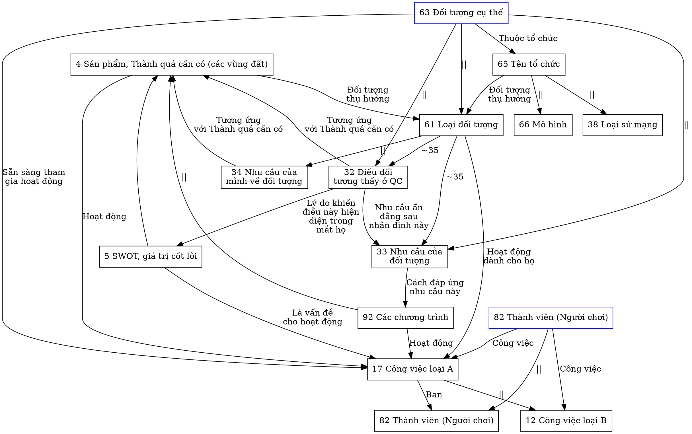

```mermaid
flowchart TD

2[2 Thành quả cần có]
4[5 SWOT, giá trị cốt lõi]

11[17 Công việc loại A]
12[12 Công việc thành phần]

31[61 Loại đối tượng]
32[32 Điều đối\ntượng thấy ở QC]
33[33 Nhu cầu của\nđối tượng]
34[34 Nhu cầu của\nmình về đối tượng]
35[63 Đối tượng cụ thể]
36[65 Tên tổ chức]
37[66 Mô hình]
38[38 Loại sứ mạng]

61[82 Thành viên (Người chơi)]
62[82 Thành viên (Người chơi)]

92[92 Các chương trình]

35 --"||"--> 31
35 --"||"--> 32
35 --"||"--> 33
31 --"~35" --> 32
31 --"~35" --> 33
32 --Lý do khiến\nđiều này hiện\ndiện trong\nmắt họ--> 4
32 --Nhu cầu ẩn\nđằng sau\nnhận định này--> 33
34 --Tương ứng\nvới Thành quả cần có--> 2
32 --Tương ứng\nvới Thành quả cần có--> 2
35 --Hoạt động đã/nhận\nlàm trong tổ chức--> 34
35 --Thuộc tổ chức--> 36
36 --Đối tượng\nthụ hưởng--> 31
36 --"||"--> 37
36 --"||"--> 38

33 --Cách đáp ứng\nnhu cầu này--> 92
92 --"Hoạt động"--> 11
92 --"||"--> 2
35 --Hoạt động đã/nhận\nlàm trong tổ chức--> 11
31 --Hoạt động\ndành cho họ--> 11
2 --Đối tượng\nthụ hưởng--> 31
2 --Hoạt động--> 11
4 --Là vấn đề\ncho hoạt động--> 11
4 --"||"--> 2

11 --"||"--> 12
62 --Công việc--> 11
62 --Công việc--> 12
62 --"||"--> 61
```

Xem thêm
Mâu thuẫn

